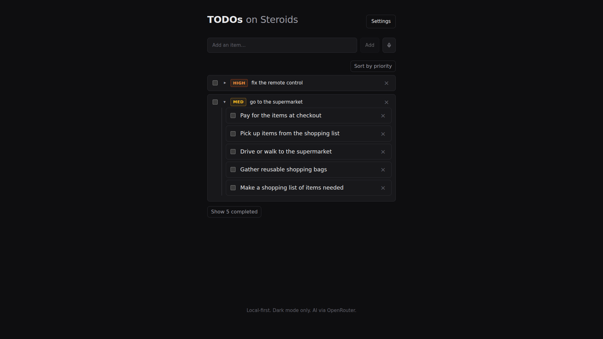

# TODOs on Steroids

A minimalist, dark-mode-only todo list that uses [OpenRouter](https://openrouter.ai)
to infer priority and break complex items into subtasks. Everything is stored
locally in your browser via IndexedDB. No accounts, no server.



## Features

- **AI subtasks** — for complex items, the model generates 2–5 actionable
  subtasks as child items. Simple items are left alone.
- **Priority inference** — each item is tagged `low` / `med` / `high` /
  `urgent` and can be sorted by priority.
- **Voice input** — dictate items via the mic button (OpenRouter STT).
- **Local-first** — all items live in IndexedDB; your API key stays in
  `localStorage`.
- **Dark mode only** — plain CSS, no theme system.

## Quick start

```bash
npm install
npm run dev      # http://localhost:5173
npm run build    # production build into dist/
npm run preview  # serve the production build
```

Then open **Settings** (top-right) and paste your OpenRouter API key. The key is
stored only in this browser's `localStorage` and is sent solely to OpenRouter.

## How AI generation works

- When an item is created, the model returns a `priority` and (if the item is
  complex) a list of `subtasks`. Subtasks are created as child items under the
  parent.
- On edit, a signature (`sha256` of the normalized text) is compared to the last
  one the model saw. If it changed, generation is re-enqueued (debounced 800ms).
- In-flight requests are abortable, so rapid edits don't race.
- Errors (network, 429, 5xx) do not overwrite existing AI results — previous
  notes and subtasks are preserved.

## Privacy

- Your API key lives only in `localStorage`; it is never logged and never sent
  anywhere except OpenRouter.
- Item text is sent to OpenRouter for generation — that is the only external
  call. There is no analytics or telemetry.
- Use **Settings → Clear all data** to wipe every item from IndexedDB.

## Tech

- Vite + React + TypeScript
- IndexedDB via `idb-keyval`
- Plain CSS, dark palette hardcoded (no theme system by design)
- OpenRouter Chat Completions (default model `openrouter/z-ai/glm-5.2`,
  configurable in Settings) + OpenRouter STT (`openai/whisper-1`)

## Project layout

```
src/
  main.tsx, App.tsx
  db/store.ts        # IndexedDB wrapper
  ai/openrouter.ts   # client, prompt, JSON parsing, signature, STT
  ai/types.ts
  components/        # ItemList, Item, ItemEditor, AddItem, Settings
  hooks/             # useItems, useAI, useSettings, useVoiceInput
  styles.css         # dark-only
```
